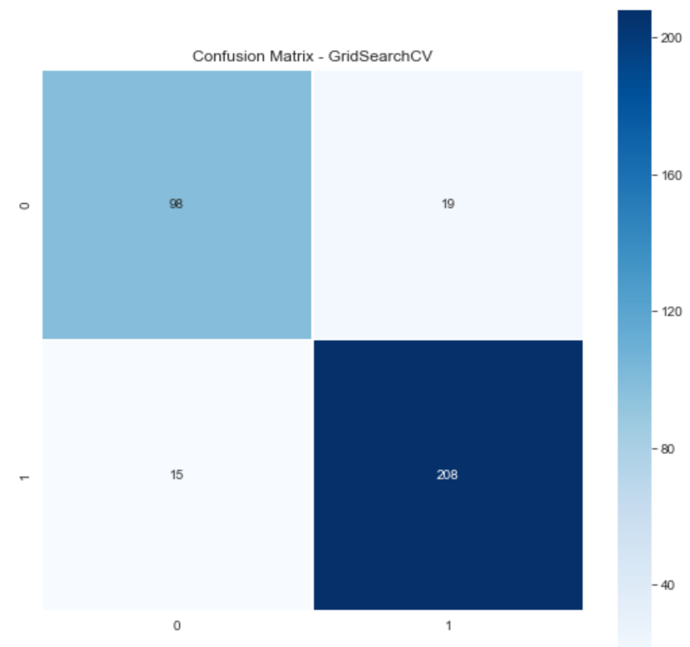

# Using Machine Learning Models to Evaluate Lebron James Impact on Team Success (Win/Loss)    
### Project Description/ Motivation
Lebron James is widely accepted as the best player of this generation. Some even argue that he is the Greatest of all time. 
There are many reasons why NBA fans believe this, but what type of impact does he have truly have on his teams success? Although Lebron James passes the 'eye-test' very easily, this project applies a more quantatative approach. This project takes Lebron's statistics on a nightly basis into consideration and then predicts whether or not his team resulted in a Win or Loss. 

## **Data Source** 

The initial source of information is from nba-reference.com
The dataset includes every game that Lebron James has played from the year 2003 - 2018. (exluding when he played for the Lakers).
The data cleaning process included:
* Feature dropping 
* Feature renaming 
* Transforming categorical to binary variables 
* Replacing null values 
* Creating other features that take advance basketball metrics into consideration

## **Features** 
There are a total of 24 features, which included:

* Age 
* Minutes Played 
* Team 
* Field-Goals Made 
* Field-Goals Attempted 
* Field Goal % 
* 3-pointers made 
* 3-pointers attemped 
* 3-point % 
* Free-Throws Made 
* Free Throws Attempted 
* Free-Throw % 
* Offensive Rebounds 
* Defensive Rebounds 
* Total Rebounds 
* Assists 
* Turnovers 
* Steals 
* Blocks 
* Points 
* Game-Score 
* Plus-Minus Score

 **Engineered Features Included:** (Advanced Basketball Metrics)

* Asist to Turnover Ratio - A better metric to quantify ball handling.

* Effective Field Goal % - A better metric to quantify shooting ability. 

 **Target**

The target variable is whether or not Lebron's team Won or Loss the game.  

## **Exploratory Data Analysis**

#### Graph displaying total count for target. Class imbalance - Win (66%) Lose(34%).

#### Graph diplaying career count for various features and game outcome (Win or Lose).

#### A closer look at Win/Lose for certain features.

## **Modeling**
Models Include: (Grid Search method was used to find best hyperparameter values) 
* Logistic Regression (Baseline Model) 
* Decision Tree Model (after hyperparamter Tuning) 
* Random Forest Model (after hyperparamter tuning) 
* XG Boost Model (after hyperparameter tuning). 

Validation (Testing) Accuracy was chosen as the metric to select the best model. 

#### Logistic Regression Model (baseline).

Training Accuracy 89.4 % Testing Accuracy 86.9 %
#### Decision Tree Model 

Training Accuracy 94.19 % Testing Accuracy 87.94 %
#### Random Forest Model

Training Accuracy 89.52 % Testing Accuracy 90 %
#### XG Boost Model 

Training Accuracy 92.42 % Testing Accuracy 91.48 %

All the models were very good at classifying wins accuratley but XG Boost model was the best at reducing False negatives and False positives, which resulted in the best Validation accuracy score. 

The plus-minus score feature provides the most information gain when classifying Win or Loss. The previous models also indicated plus-minus score as the feature providing the most information gain. Other features in the previous models were not providing much information gain but in the XG Boost model they did.  
## **Best Model** 

XGBoost has the best Validation Accuracy at 91.48%. Also the difference between the training and testing accuracy for XGBoost is the smallest, indicating that the model is not overfitting. 
## **Conclusions**
It is interesting to note that Team Success(Win/Lose) can be determined with such high accuracy by simply including only 1-players statistics, Lebron James. The results demonstrate Lebrons performance (whether good or bad) has a major impact on his team's success. Historically his team's have relied heavily on his performance.  

## **Things to Consider in the Future**
Since plus-minus score was the most important feature in all of the models, running the best model without the plus-minus feature present to see what effect it has on the model and accuracy. 
Running the best model on an average player with a similar career arc as Lebron and them comparing the results would further demonstrate Lebron's impact on his teams success.
Further improving accuracy by running other types of models, adding features, and adjusting for class imbalance. Can use further scale project by using similar methods on other players to see what impact they have on their teams. 

